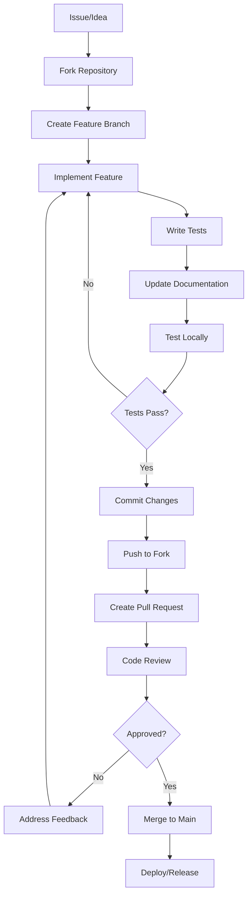
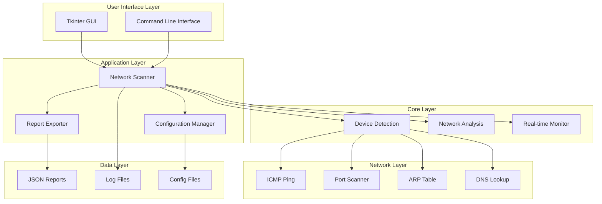
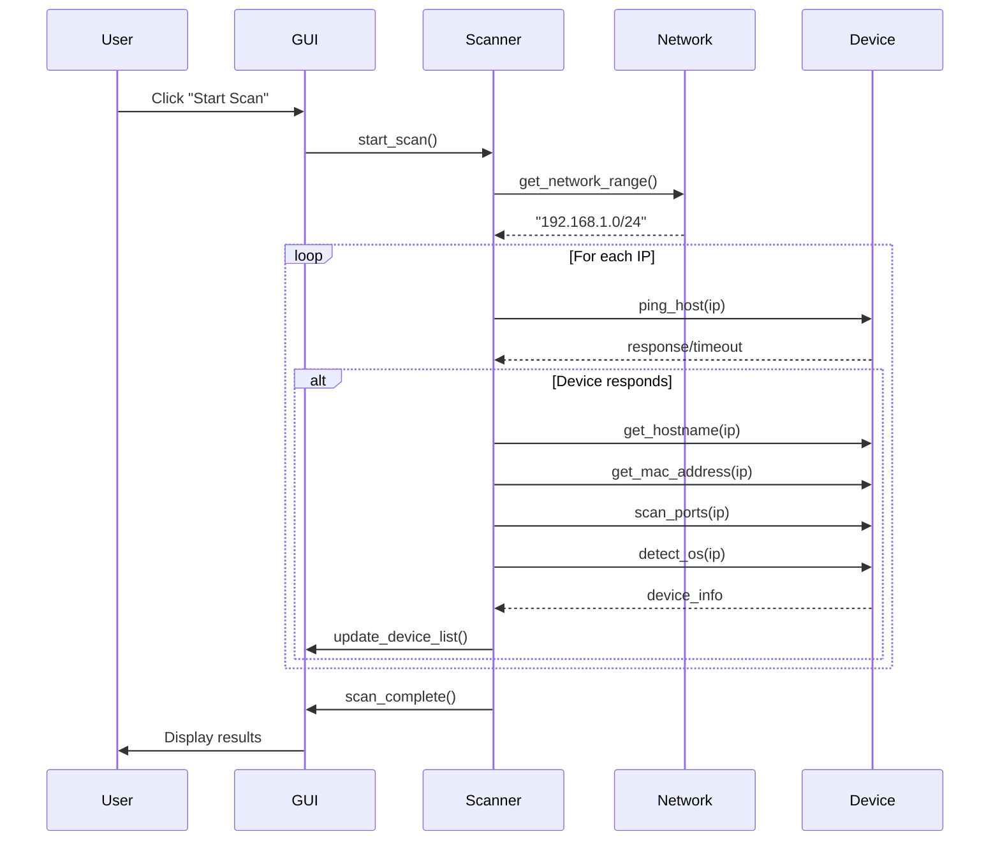
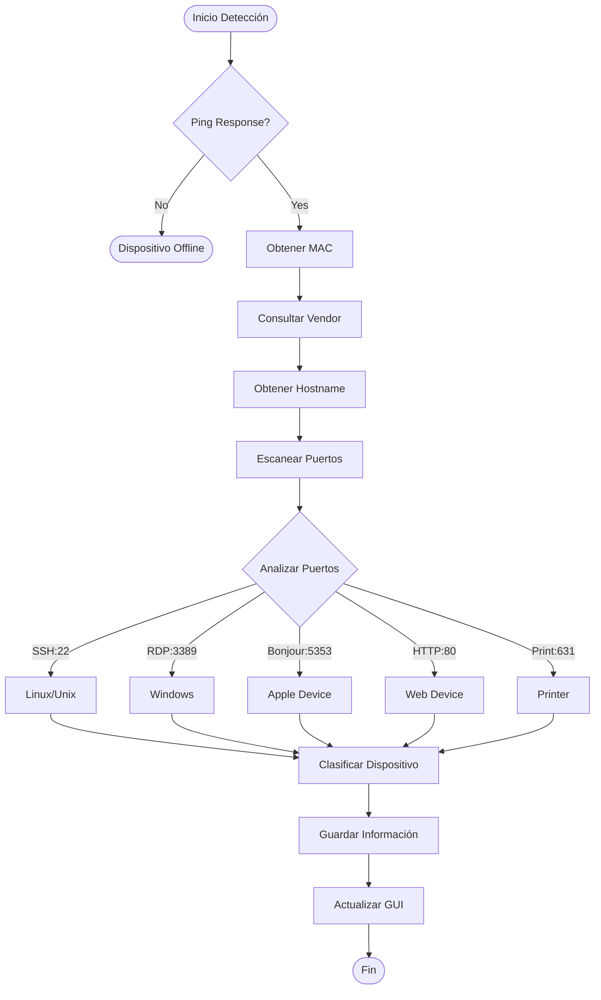

# 🌐 Network Scanner Pro

<div align="center">


**Herramienta avanzada de descubrimiento y análisis de red con interfaz gráfica profesional**

[Características](#-características) • [Instalación](#-instalación) • [Uso](#-uso) • [Contribución](#-contribución) • [Documentación](#-documentación)

</div>

---

## 📋 Tabla de Contenido

- [Descripción](#-descripción)
- [Características](#-características)
- [Requisitos del Sistema](#-requisitos-del-sistema)
- [Instalación](#-instalación)
- [Uso](#-uso)
- [Estructura del Proyecto](#-estructura-del-proyecto)
- [Contribución](#-contribución)
- [Seguridad y Privacidad](#-seguridad-y-privacidad)
- [Roadmap](#-roadmap)
- [Licencia](#-licencia)
- [Desarrollador](#-desarrollador)

---

## 📖 Descripción

Network Scanner Pro es una herramienta de código abierto desarrollada en Python que permite el descubrimiento, análisis y monitoreo de dispositivos en redes locales. Con una interfaz gráfica moderna y capacidades avanzadas de detección, es ideal tanto para administradores de red como para usuarios domésticos.

### 🎯 Objetivo del Proyecto

Proporcionar una herramienta **gratuita**, **potente** y **fácil de usar** para el análisis de redes locales, con capacidades de:

- ✅ Detección automática de dispositivos
- ✅ Clasificación inteligente por tipo de dispositivo  
- ✅ Análisis de seguridad básico
- ✅ Monitoreo en tiempo real
- ✅ Reportes detallados y exportables

---

## ✨ Características

### 🔍 Capacidades de Escaneo

| Tipo de Escaneo | Descripción | Tiempo Estimado | Uso Recomendado |
|------------------|-------------|-----------------|-----------------|
| **⚡ Escaneo Rápido** | Análisis de dispositivos comunes (1-50) | 30-60 segundos | Uso diario |
| **🔬 Escaneo Profundo** | Análisis completo de la red (1-254) | 3-10 minutos | Análisis exhaustivo |
| **📡 Monitoreo Continuo** | Seguimiento en tiempo real | Indefinido | Supervisión activa |

### 🖥️ Detección Inteligente de Dispositivos

- **📱 Dispositivos Móviles**: iOS, Android, tablets
- **💻 Computadoras**: Windows, macOS, Linux
- **📺 Smart TV & Streaming**: Apple TV, Chromecast, Smart TVs
- **🖨️ Impresoras & IoT**: Impresoras de red, dispositivos inteligentes
- **🌐 Infraestructura**: Routers, switches, puntos de acceso
- **🎮 Gaming**: PlayStation, Xbox, Nintendo Switch
- **🏠 Smart Home**: Alexa, Google Home, termostatos

### 📊 Análisis Avanzado

- **🔍 Fingerprinting de SO**: Detección automática del sistema operativo
- **⚡ Análisis de Latencia**: Medición precisa de tiempos de respuesta
- **🏭 Identificación de Vendor**: Reconocimiento del fabricante por dirección MAC
- **🔐 Evaluación de Seguridad**: Detección de puertos abiertos y riesgos básicos
- **📈 Estadísticas de Red**: Análisis de rendimiento y conectividad

### 🎨 Interfaz Gráfica Moderna

- **🌙 Tema Oscuro/Claro**: Interfaz personalizable y cómoda para los ojos
- **📊 Vista en Tabla**: Organización clara y ordenada de dispositivos
- **ℹ️ Panel de Detalles**: Información completa de cada dispositivo detectado
- **📊 Barra de Progreso**: Monitoreo visual del estado del escaneo
- **⌨️ Atajos de Teclado**: Navegación rápida y eficiente

### 📄 Reportes y Exportación

- **📋 Formato JSON**: Datos estructurados para análisis automatizado
- **📝 Formato TXT**: Reportes legibles y presentables
- **📊 Análisis Estadístico**: Resúmenes de tipos de dispositivos y métricas
- **💾 Guardado Automático**: Historial de escaneos para comparación

---

## 🔧 Requisitos del Sistema

### 💻 Sistemas Operativos Soportados

| SO | Versiones | Estado |
|----|-----------|--------|
| **Windows** | 10, 11 | ✅ Completamente soportado |
| **Linux** | Ubuntu 20.04+, Debian 10+, CentOS 8+ | ✅ Completamente soportado |
| **macOS** | 10.15+ (Catalina o superior) | ✅ Completamente soportado |

### 🐍 Requisitos de Software

- **Python**: 3.7 o superior (recomendado 3.9+)
- **Tkinter**: Incluido con Python (verificar instalación)
- **Permisos**: Usuario estándar (no requiere privilegios de administrador)
- **Red**: Conexión a red local activa

### 📦 Dependencias Python





### 🔄 Flujo de Escaneo



### 🎯 Detección de Dispositivos



---
## 🚀 Instalación

### Método 1: Instalación Estándar ⭐ (Recomendado)

#### 1️⃣ Clonar el Repositorio
```bash
git clone https://github.com/felipesanchez-dev/network-scanner-pro.git
cd network-scanner-pro
```

#### 2️⃣ Crear Entorno Virtual (Altamente Recomendado)
```bash
# Windows
python -m venv scanner_env
scanner_env\Scripts\activate

# Linux/macOS
python3 -m venv scanner_env
source scanner_env/bin/activate
```

#### 3️⃣ Instalar Dependencias
```bash
pip install -r requirements.txt
```

#### 4️⃣ Ejecutar la Aplicación
```bash
python main.py
```

### Método 2: Instalación con Funcionalidades Avanzadas

Para capacidades adicionales como detección avanzada de SO:

```bash
# Instalar dependencias opcionales
pip install python-nmap scapy

# Verificar instalación
python -c "import nmap, scapy; print('✅ Dependencias avanzadas instaladas')"
```

### Método 3: Instalación con Docker 🐳

```bash
# Construir imagen
docker build -t network-scanner-pro .

# Ejecutar contenedor con acceso a red
docker run -it --network host network-scanner-pro
```

### 🔧 Solución de Problemas Comunes

#### ❌ Error de Tkinter en Linux
```bash
# Ubuntu/Debian
sudo apt-get install python3-tk python3-dev

# CentOS/RHEL/Fedora
sudo dnf install tkinter python3-tkinter
```

#### ❌ Problemas de Permisos (Linux/macOS)
```bash
# Dar permisos para ping sin sudo
sudo setcap cap_net_raw+ep $(which python3)

# O ejecutar con sudo si es necesario
sudo python3 main.py
```

#### ❌ Error de Módulos No Encontrados
```bash
# Verificar que el entorno virtual esté activo
which python  # Debe mostrar la ruta del entorno virtual

# Reinstalar dependencias
pip install --upgrade -r requirements.txt
```

---

## 📘 Uso

### 🚀 Inicio Rápido

1. **Ejecutar la aplicación**:
   ```bash
   python main.py
   ```

2. **Realizar tu primer escaneo**:
   - Haz clic en **"⚡ Quick Scan"** para un escaneo rápido
   - O selecciona **"🔬 Deep Scan"** para un análisis completo

3. **Explorar resultados**:
   - Selecciona cualquier dispositivo de la lista
   - Revisa la información detallada en el panel derecho
   - Exporta los resultados si necesitas un reporte

### 🎮 Controles y Atajos

| Atajo | Función | Descripción |
|-------|---------|-------------|
| `Ctrl+N` | Nuevo escaneo rápido | Inicia un escaneo rápido inmediatamente |
| `Ctrl+D` | Escaneo profundo | Ejecuta un análisis completo de la red |
| `F5` | Refrescar | Actualiza la vista actual |
| `Ctrl+S` | Exportar reporte | Guarda los resultados del último escaneo |
| `Ctrl+Q` | Salir | Cierra la aplicación |
| `Esc` | Detener escaneo | Cancela el escaneo en progreso |

### 📊 Interpretación de Resultados

#### Estados de Dispositivos
- 🟢 **Online**: Dispositivo activo y respondiendo a ping
- 🔴 **Offline**: Dispositivo detectado pero no responde actualmente
- ⚠️ **Parcial**: Dispositivo responde parcialmente

#### Métricas de Rendimiento
| Latencia | Calificación | Descripción |
|----------|--------------|-------------|
| < 10ms | 🟢 Excelente | Red local muy rápida |
| 10-50ms | 🟡 Bueno | Rendimiento normal |
| 50-100ms | 🟠 Regular | Posible congestión |
| > 100ms | 🔴 Lento | Problemas de conectividad |

#### Niveles de Riesgo de Seguridad
| Nivel | Criterios | Recomendación |
|-------|-----------|---------------|
| 🟢 **Bajo** | < 5 puertos abiertos, servicios estándar | Seguridad aceptable |
| 🟡 **Medio** | 5+ puertos abiertos | Revisar configuración |
| 🔴 **Alto** | Servicios inseguros detectados | Acción inmediata requerida |

---


### 🔧 Descripción de Archivos Principales

#### `main.py` - Aplicación Principal
- **Clase NetworkScanner**: Controlador principal de la aplicación
- **GUI Management**: Configuración y manejo de la interfaz gráfica
- **Scan Logic**: Algoritmos de detección y análisis de red
- **Export Functions**: Funcionalidades de exportación de reportes


---

## 🤝 Contribución

### 🌟 ¿Cómo Puedes Contribuir?

¡Tu contribución es muy valiosa! Hay muchas formas de ayudar:

#### 🐛 Reportar Bugs
- Busca issues existentes antes de crear uno nuevo
- Incluye información detallada del sistema
- Proporciona pasos para reproducir el problema

#### 💡 Sugerir Mejoras
- Describe claramente la funcionalidad propuesta
- Explica el beneficio para los usuarios
- Considera la viabilidad técnica

#### 💻 Contribuir Código
- Fork el repositorio
- Sigue las convenciones de código
- Incluye tests para nuevas funcionalidades
- Actualiza la documentación cuando sea necesario

### 📋 Proceso de Contribución

#### 1️⃣ Preparar el Entorno
```bash
# Fork y clonar
git clone https://github.com/tu-usuario/network-scanner-pro.git
cd network-scanner-pro

# Crear rama de desarrollo
git checkout -b feature/nueva-funcionalidad
```

#### 2️⃣ Desarrollar
```bash
# Realizar cambios
# ... código ...

# Ejecutar tests
python -m pytest tests/

# Verificar estilo de código
python -m flake8 main.py
```

#### 3️⃣ Commit y Push
```bash
# Commit con formato convencional
git commit -m "feat(scanner): añadir detección de dispositivos IPv6"

# Push a tu fork
git push origin feature/nueva-funcionalidad
```

#### 4️⃣ Pull Request
- Crea un PR con descripción detallada
- Referencia issues relacionados
- Espera el review del código

### 📝 Convenciones de Commits

| Tipo | Descripción | Ejemplo |
|------|-------------|---------|
| `feat` | Nueva funcionalidad | `feat(scan): añadir soporte IPv6` |
| `fix` | Corrección de bug | `fix(gui): corregir crash al exportar` |
| `docs` | Documentación | `docs(readme): actualizar guía instalación` |
| `style` | Formato código | `style(main): aplicar PEP8` |
| `refactor` | Refactorización | `refactor(scanner): optimizar algoritmo ping` |
| `test` | Tests | `test(core): añadir tests unitarios` |
| `perf` | Rendimiento | `perf(scan): reducir tiempo escaneo 50%` |

### 🎯 Áreas Prioritarias

#### 🔧 Desarrollo Core
- [ ] Soporte para IPv6
- [ ] Detección de servicios avanzada
- [ ] Optimización de algoritmos
- [ ] Caché inteligente de resultados

#### 🎨 Interfaz de Usuario
- [ ] Temas personalizables
- [ ] Gráficos de red interactivos
- [ ] Modo oscuro mejorado
- [ ] Accesibilidad completa

#### 📊 Análisis y Reportes
- [ ] Exportar a CSV/Excel
- [ ] Reportes PDF
- [ ] Comparación histórica
- [ ] Alertas automáticas

#### 🧪 Testing y Calidad
- [ ] Aumentar cobertura de tests (objetivo: 90%)
- [ ] Tests de integración
- [ ] Benchmarks de rendimiento
- [ ] Tests de compatibilidad

---

## 🔐 Seguridad y Privacidad

### 🛡️ Principios de Seguridad

#### ✅ Diseño Seguro
- **Principio de menor privilegio**: Funciona con permisos de usuario estándar
- **Sin comunicación externa**: Solo consultas de vendor por MAC (opcional)
- **Datos locales únicamente**: Toda la información permanece en tu equipo
- **Código transparente**: Open source y auditable

#### 🔒 Protección de Datos
- **Sin almacenamiento de credenciales**: No guarda contraseñas ni tokens
- **Cifrado opcional**: Posibilidad de cifrar reportes sensibles
- **Rotación de logs**: Limpieza automática de archivos antiguos
- **Control total del usuario**: Decides qué información guardar

### ⚖️ Uso Responsable

#### ✅ Usos Permitidos
- Análisis de tu propia red doméstica
- Administración de redes corporativas autorizadas
- Educación y aprendizaje en entornos controlados
- Auditorías de seguridad con autorización

#### ❌ Usos Prohibidos
- Escaneo de redes sin autorización
- Actividades que violen la privacidad
- Acceso no autorizado a sistemas
- Cualquier actividad ilegal

### 📋 Declaración de Privacidad

1. **📍 Datos Locales**: Toda la información se procesa y almacena localmente
2. **🚫 Sin Telemetría**: No enviamos datos de uso ni estadísticas
3. **🔓 Control Total**: Tú decides qué información guardar o eliminar
4. **🔍 Transparencia**: Código fuente completamente abierto

---


---

## 📄 Licencia

Este proyecto está licenciado bajo la **Licencia MIT** - ver el archivo [LICENSE](LICENSE) para más detalles.

### 📋 Resumen de la Licencia MIT

✅ **Permisos**:
- Uso comercial y personal
- Modificación del código fuente
- Distribución libre
- Uso privado sin restricciones

❗ **Condiciones**:
- Incluir copyright y licencia en copias
- Mantener atribución al autor original

🚫 **Limitaciones**:
- Sin garantía de funcionamiento
- Sin responsabilidad por daños
- Sin soporte técnico obligatorio

---

## 👨‍💻 Desarrollador

<div align="center">
  
  
  ### **Felipe Reyes Sanchez**
  *Full Stack Developer & Network Security Enthusiast*
  
  > "Desarrollando herramientas que hacen la tecnología más accesible y segura para todos"
</div>

#### 🌟 Sobre el Desarrollador

Soy un desarrollador apasionado por crear herramientas que resuelvan problemas reales. Network Scanner Pro nació de la necesidad de tener una herramienta simple pero poderosa para el análisis de redes domésticas y pequeñas empresas.

#### 💼 Especialidades
- **Frontend**: React, Vue.js, Svelte
- **Backend**: Python, Node.js, Django
- **Mobile**: React Native, Flutter
- **DevOps**: Docker, AWS, Linux
- **Security**: Network Analysis, Penetration Testing

#### 📫 ¿Cómo Contactarme?

<div align="center">

[](https://felipesanchezdev.site)
[](mailto:felipe@felipesanchezdev.site)
[](https://www.linkedin.com/in/felipereyessa)
[](https://github.com/felipesanchez-dev)
[](https://www.instagram.com/felipesanchez_dev)
[](https://wa.me/573102452542)

</div>

---

<div align="center">

## 🌟 ¿Te Gusta el Proyecto?

Si este proyecto te ha sido útil, considera apoyarlo:

### ⭐ Dale una Estrella
[](https://github.com/felipesanchez-dev/network-scanner-pro/stargazers)

### 🍴 Haz un Fork
[](https://github.com/felipesanchez-dev/network-scanner-pro/network/members)

### 👀 Sígueme
[](https://github.com/felipesanchez-dev)

---

### 💝 Formas de Apoyar

- ⭐ **Dale estrella al repositorio**
- 🐛 **Reporta bugs o sugiere mejoras**
- 💻 **Contribuye con código**
- 📢 **Comparte el proyecto**
- ☕ **Invítame un café** (próximamente)

---


*"La mejor forma de predecir el futuro es construyéndolo"*

</div>