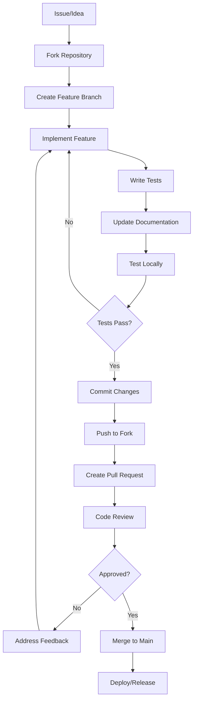
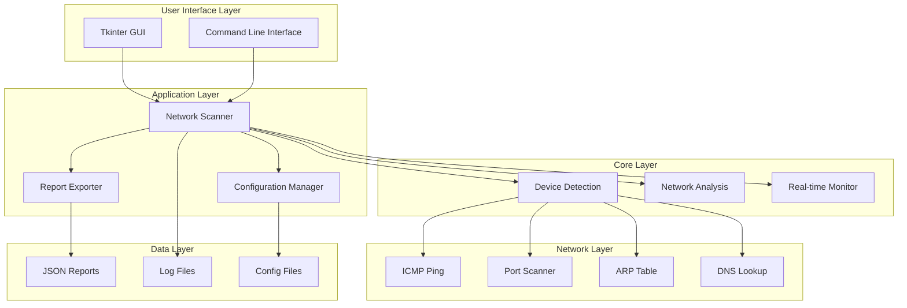
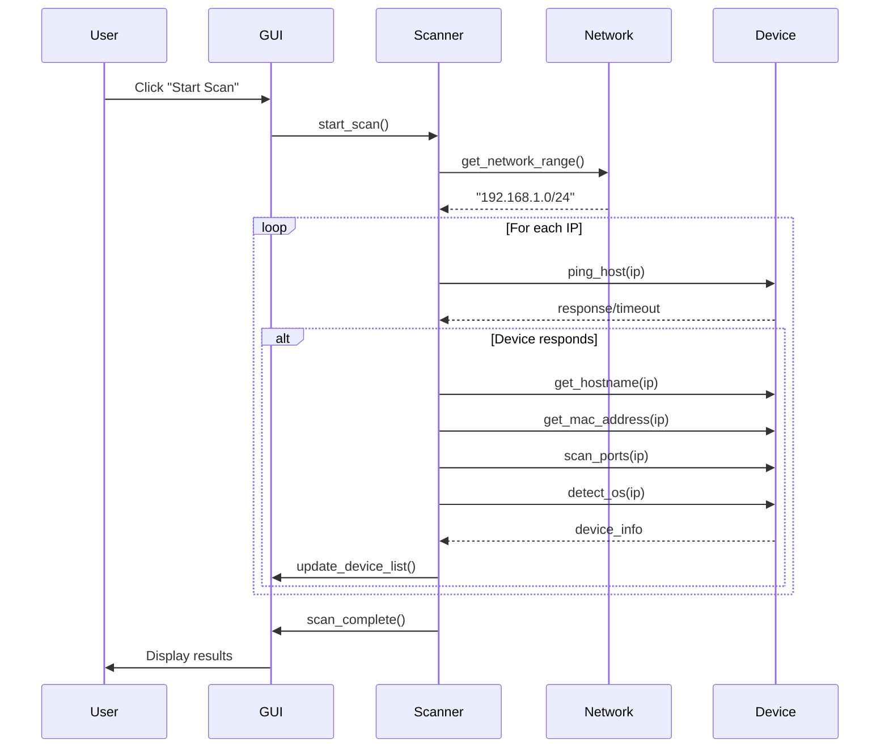
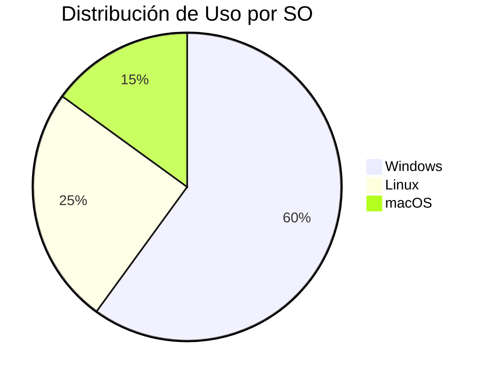

# 🌐 Network Scanner

<div align="center">


**Herramienta avanzada de descubrimiento y análisis de red con interfaz gráfica profesional**

[Características](#características) • [Instalación](#instalación) • [Uso](#uso) • [Contribución](#contribución) • [Estructura](#estructura)

</div>

---

## 📋 Tabla de Contenido

- [Descripción](#descripción)
- [Características](#características)
- [Requisitos del Sistema](#requisitos-del-sistema)
- [Instalación](#instalación)
- [Uso](#uso)
- [Estructura del Proyecto](#estructura-del-proyecto)
- [Contribución](#contribución)
- [Roadmap](#roadmap)
- [Licencia](#licencia)
- [Soporte](#soporte)

---

## 📖 Descripción

Network Scanner Pro es una herramienta de código abierto desarrollada en Python que permite el descubrimiento, análisis y monitoreo de dispositivos en redes locales. Con una interfaz gráfica moderna y capacidades avanzadas de detección, es ideal tanto para administradores de red como para usuarios domésticos.

### 🎯 Objetivo del Proyecto

Proporcionar una herramienta gratuita, potente y fácil de usar para el análisis de redes locales, con capacidades de:
- Detección automática de dispositivos
- Clasificación inteligente por tipo de dispositivo
- Análisis de seguridad básico
- Monitoreo en tiempo real
- Reportes detallados

---

## ✨ Características

### 🔍 Capacidades de Escaneo
- **Escaneo Profundo**: Análisis completo de toda la red (254 hosts)
- **Escaneo Rápido**: Detección rápida de dispositivos comunes (50 hosts)
- **Monitoreo en Tiempo Real**: Seguimiento continuo del estado de los dispositivos
- **Detección de Puertos**: Identificación de servicios activos

### 🖥️ Detección de Dispositivos
- **Clasificación Inteligente**: Identificación automática del tipo de dispositivo
  - 📱 Dispositivos móviles (iOS, Android)
  - 💻 Computadoras (Windows, Mac, Linux)
  - 📺 Smart TVs y dispositivos de streaming
  - 🖨️ Impresoras e IoT
  - 🌐 Infraestructura de red
  - 🎮 Consolas de juegos
  - 📟 Dispositivos domésticos inteligentes

### 📊 Análisis Avanzado
- **Fingerprinting de SO**: Detección del sistema operativo
- **Análisis de Latencia**: Medición de tiempo de respuesta
- **Identificación de Vendor**: Reconocimiento del fabricante por MAC
- **Evaluación de Seguridad**: Detección de riesgos básicos

### 🎨 Interfaz Gráfica
- **Tema Oscuro/Claro**: Interfaz moderna y personalizable
- **Vista en Tabla**: Organización clara de la información
- **Panel de Detalles**: Información completa de cada dispositivo
- **Barra de Estado**: Monitoreo del progreso en tiempo real

### 📄 Reportes y Exportación
- **Formato JSON**: Datos estructurados para análisis
- **Formato TXT**: Reportes legibles para humanos
- **Análisis Estadístico**: Resumen de tipos de dispositivos y métricas

---

## 🔧 Requisitos del Sistema

### Sistemas Operativos Soportados
- **Windows**: 10/11 (recomendado)
- **Linux**: Ubuntu 20.04+, Debian 10+, CentOS 8+
- **macOS**: 10.15+ (Catalina o superior)

### Requisitos de Software
- **Python**: 3.7 o superior
- **Tkinter**: Incluido con Python
- **Permisos**: Usuario estándar (no requiere privilegios de administrador)

### Dependencias Python
```txt
requests==2.31.0
python-nmap==0.7.1 (opcional)
psutil==5.9.8
scapy==2.5.0 (opcional)
```

---

## 🚀 Instalación

### Método 1: Instalación Estándar

#### 1. Clonar el Repositorio
```bash
git clone https://github.com/usuario/network-scanner-pro.git
cd network-scanner-pro
```

#### 2. Crear Entorno Virtual (Recomendado)
```bash
# Windows
python -m venv scanner_env
scanner_env\Scripts\activate

# Linux/macOS
python3 -m venv scanner_env
source scanner_env/bin/activate
```

#### 3. Instalar Dependencias
```bash
pip install -r requirements.txt
```

#### 4. Ejecutar la Aplicación
```bash
python main.py
```

### Método 2: Instalación con Dependencias Opcionales

Para funcionalidades avanzadas, instala las dependencias opcionales:

```bash
# Para detección avanzada de SO con Nmap
pip install python-nmap

# Para análisis de paquetes con Scapy
pip install scapy
```

### Método 3: Instalación en Docker

```bash
# Construir imagen
docker build -t network-scanner-pro .

# Ejecutar contenedor
docker run -it --network host network-scanner-pro
```

### Solución de Problemas Comunes

#### Error de Tkinter en Linux
```bash
# Ubuntu/Debian
sudo apt-get install python3-tk

# CentOS/RHEL
sudo yum install tkinter
```

#### Permisos en Linux/macOS
```bash
# Si hay problemas con ping
sudo setcap cap_net_raw+ep /usr/bin/python3
```

---

## 📘 Uso

### Inicio Rápido

1. **Ejecutar la aplicación**:
   ```bash
   python main.py
   ```

2. **Realizar un escaneo rápido**:
   - Clic en "⚡ Quick Scan"
   - Esperar a que termine el escaneo

3. **Ver detalles de un dispositivo**:
   - Seleccionar un dispositivo de la lista
   - Ver información detallada en el panel derecho

### Funcionalidades Principales

#### 🔍 Tipos de Escaneo

| Tipo | Descripción | Tiempo Estimado | Uso Recomendado |
|------|-------------|-----------------|-----------------|
| **Quick Scan** | Escanea IPs 1-50 | 30-60 segundos | Uso diario |
| **Deep Scan** | Escanea toda la red | 3-10 minutos | Análisis completo |
| **Monitor** | Monitoreo continuo | Indefinido | Supervisión |

#### 🎮 Controles de Teclado

| Atajo | Función |
|-------|---------|
| `Ctrl+N` | Nuevo escaneo rápido |
| `F5` | Refrescar |
| `Ctrl+S` | Exportar reporte |
| `Esc` | Detener escaneo |

#### 📊 Interpretación de Resultados

**Estados de Dispositivos:**
- 🟢 **Online**: Dispositivo activo y respondiendo
- 🔴 **Offline**: Dispositivo no responde

**Métricas de Rendimiento:**
- **< 10ms**: Excelente
- **10-50ms**: Bueno
- **> 50ms**: Regular

**Niveles de Riesgo:**
- **Bajo**: < 5 puertos abiertos
- **Medio**: 5+ puertos abiertos
- **Alto**: Servicios inseguros detectados

---


### 🗂️ Descripción de Módulos

#### `main.py`
Punto de entrada principal que contiene:
- Clase `NetworkScanner`: Controlador principal
- Métodos de GUI: Configuración de interfaz
- Lógica de escaneo: Algoritmos de detección
- Gestión de configuración: Carga y guardado

#### `scanner_config.json`
Archivo de configuración que incluye:
```json
{
  "scan_timeout": 3,
  "max_workers": 50,
  "ping_timeout": 1000,
  "port_timeout": 1,
  "theme": "dark",
  "auto_save": true,
  "save_history": true
}
```

---


### 🎯 Áreas de Contribución

#### 🔧 Desarrollo Core
- **Algoritmos de escaneo**: Mejorar velocidad y precisión
- **Detección de dispositivos**: Añadir nuevos patrones
- **Protocolos de red**: Soporte para IPv6, mDNS
- **Optimización**: Reducir uso de CPU y memoria

#### 🎨 Interfaz de Usuario
- **Nuevos temas**: Crear temas personalizados
- **Widgets avanzados**: Gráficos, mapas de red
- **Accesibilidad**: Soporte para lectores de pantalla
- **Internacionalización**: Traducir a otros idiomas

#### 📊 Análisis y Reportes
- **Formatos de exportación**: CSV, XML, PDF
- **Visualizaciones**: Gráficos de red, estadísticas
- **Análisis histórico**: Comparación temporal
- **Alertas**: Notificaciones de cambios

#### 🧪 Testing y QA
- **Tests unitarios**: Cobertura de código
- **Tests de integración**: Flujos completos
- **Tests de rendimiento**: Benchmarks
- **Tests de compatibilidad**: Diferentes SO

#### 📚 Documentación
- **Tutoriales**: Guías paso a paso
- **API Reference**: Documentación técnica
- **Ejemplos**: Casos de uso prácticos
- **Videos**: Contenido multimedia

### 📋 Guías de Estilo

#### Python (PEP 8)
```python
# ✅ Correcto
def scan_device(ip_address: str, timeout: int = 3) -> Dict[str, Any]:
    """Escanear un dispositivo específico.
    
    Args:
        ip_address: Dirección IP a escanear
        timeout: Tiempo límite en segundos
        
    Returns:
        Diccionario con información del dispositivo
    """
    device_info = {}
    # ... lógica de escaneo
    return device_info

# ❌ Incorrecto
def scanDev(ip,t=3):
    deviceInfo={}
    return deviceInfo
```

#### Documentación
```python
class NetworkScanner:
    """Escáner de red principal.
    
    Esta clase proporciona funcionalidad para detectar y analizar
    dispositivos en la red local usando múltiples métodos.
    
    Attributes:
        devices: Lista de dispositivos detectados
        scanning: Estado actual del escaneo
        config: Configuración del escáner
        
    Example:
        >>> scanner = NetworkScanner()
        >>> scanner.start_quick_scan()
        >>> devices = scanner.get_devices()
    """
```

### 🔄 Workflow de Desarrollo

#### Desarrollo de Nueva Funcionalidad



#### Proceso de Review

1. **Automated Checks**:
   - Tests unitarios
   - Linting (PEP 8)
   - Coverage mínimo 80%
   - Security scan

2. **Manual Review**:
   - Funcionalidad
   - Código limpio
   - Documentación
   - Performance

3. **Testing**:
   - Diferentes SO
   - Casos edge
   - Regresión

---

### 🎯 Funcionalidades Propuestas

#### 🔐 Seguridad Avanzada
```python
class SecurityAnalyzer:
    """Analizador de seguridad de red."""
    
    def detect_vulnerabilities(self, device: Device) -> List[Vulnerability]:
        """Detectar vulnerabilidades conocidas."""
        pass
    
    def check_default_credentials(self, device: Device) -> bool:
        """Verificar credenciales por defecto."""
        pass
    
    def scan_for_malware(self, device: Device) -> MalwareReport:
        """Escanear indicadores de malware."""
        pass
```

#### 📊 Analytics Dashboard
```python
class NetworkAnalytics:
    """Panel de análisis de red."""
    
    def generate_traffic_report(self) -> TrafficReport:
        """Generar reporte de tráfico."""
        pass
    
    def detect_patterns(self) -> List[Pattern]:
        """Detectar patrones de comportamiento."""
        pass
    
    def predict_failures(self) -> List[Prediction]:
        """Predecir fallos potenciales."""
        pass
```

#### 🌐 Multi-Network Support
```python
class MultiNetworkScanner:
    """Escáner para múltiples redes."""
    
    def scan_vlans(self) -> Dict[str, NetworkScan]:
        """Escanear múltiples VLANs."""
        pass
    
    def discover_subnets(self) -> List[Subnet]:
        """Descubrir subredes automáticamente."""
        pass
    
    def map_network_topology(self) -> NetworkTopology:
        """Mapear topología de red."""
        pass
```

### 📋 Lista de Issues Abiertos

#### 🐛 Bugs Conocidos
- [ ] **#001**: Timeout inconsistente en Windows 11
- [ ] **#002**: Memory leak durante escaneos largos
- [ ] **#003**: GUI freeze en sistemas con poco RAM

#### 💡 Feature Requests
- [ ] **#010**: Soporte para escáner de vulnerabilidades
- [ ] **#011**: Integración con Wireshark
- [ ] **#012**: Exportar a formatos de red (GraphML, GEXF)
- [ ] **#013**: Modo línea de comandos (CLI)

#### 🔧 Mejoras Técnicas
- [ ] **#020**: Migrar a arquitectura asíncrona
- [ ] **#021**: Implementar caché inteligente
- [ ] **#022**: Optimizar algoritmos de detección
- [ ] **#023**: Añadir logging estructurado

---

## 📊 Diagramas del Sistema

### 🏗️ Arquitectura General



### 🔄 Flujo de Escaneo



### 🎯 Detección de Dispositivos


---

## 📈 Métricas y KPIs

### 🎯 Objetivos del Proyecto

| Métrica | Objetivo | Actual | Estado |
|---------|----------|--------|--------|
| **Velocidad de Escaneo** | < 5 min para /24 | ~3 min | ✅ |
| **Precisión de Detección** | > 95% | ~92% | 🔄 |
| **Cobertura de Tests** | > 80% | 65% | 🔄 |
| **Compatibilidad SO** | 3 principales | 3/3 | ✅ |
| **Memoria Máxima** | < 100MB | ~85MB | ✅ |
| **Issues Abiertos** | < 10 | 8 | ✅ |

### 📊 Estadísticas de Uso



### 🚀 Performance Benchmarks

| Red Size | Quick Scan | Deep Scan | Memoria |
|----------|------------|-----------|---------|
| /28 (14 hosts) | 15s | 45s | 25MB |
| /26 (62 hosts) | 35s | 2m | 45MB |
| /24 (254 hosts) | 1m | 8m | 85MB |
| /22 (1022 hosts) | 4m | 35m | 180MB |

---

## 🔐 Seguridad y Privacidad

### 🛡️ Consideraciones de Seguridad

#### ✅ Prácticas Seguras
- **Sin privilegios elevados**: Funciona con usuario estándar
- **Solo red local**: No se conecta a internet (excepto vendor lookup)
- **Sin persistencia de credenciales**: No almacena contraseñas
- **Logs locales**: Información sensible solo local

#### ⚠️ Responsabilidad del Usuario
- **Uso ético**: Solo en redes propias o con autorización
- **Cumplimiento legal**: Respetar leyes locales
- **Configuración de red**: Verificar políticas de seguridad

#### 🔒 Protección de Datos
- **Datos locales**: Toda la información se mantiene local
- **Cifrado opcional**: Posibilidad de cifrar reportes
- **Limpieza automática**: Rotación de logs antiguos

### 📋 Política de Privacidad

1. **No recopilamos datos**: La aplicación no envía información a servidores externos
2. **Almacenamiento local**: Todos los datos se guardan localmente
3. **Control del usuario**: El usuario controla qué datos se guardan
4. **Transparencia**: Código abierto y auditable

---

## 🤝 Contribución

### Cómo Contribuir

1. **Fork el proyecto**

   ```bash
   git clone https://github.com/tu-usuario/agentesia.git
   ```

2. **Crear rama de feature**

   ```bash
   git checkout -b feature/nueva-caracteristica
   ```

3. **Realizar cambios**

   - Seguir convenciones de código
   - Añadir tests si es necesario
   - Actualizar documentación

4. **Commit con formato convencional**

   ```bash
   git commit -m "feat: añadir nueva característica"
   ```

5. **Push y Pull Request**
   ```bash
   git push origin feature/nueva-caracteristica
   ```

#### Tipos de Commit:

| Tipo | Descripción | Ejemplo |
|------|-------------|---------|
| `feat` | Nueva funcionalidad | `feat(scan): añadir escaneo de IPv6` |
| `fix` | Corrección de bug | `fix(gui): corregir crash al exportar` |
| `docs` | Documentación | `docs(readme): actualizar instalación` |
| `style` | Formato de código | `style(main): aplicar PEP8` |
| `refactor` | Refactorización | `refactor(scanner): optimizar algoritmo` |
| `test` | Añadir/modificar tests | `test(core): añadir tests unitarios` |
| `chore` | Tareas de mantenimiento | `chore(deps): actualizar dependencias` |
| `perf` | Mejora de rendimiento | `perf(scan): reducir tiempo de escaneo` |
| `ci` | CI/CD | `ci(github): añadir workflow` |
| `build` | Sistema de build | `build(docker): optimizar Dockerfile` |

```bash
# Estructura de commits:
feat: nueva funcionalidad
fix: corrección de bug
docs: cambios en documentación
style: cambios de formato
refactor: refactorización de código
test: agregar o modificar tests
chore: cambios en build/tools
ui: cambios en componentes UI
```


### 📋 Términos de Uso

#### ✅ Permitido
- Uso comercial y personal
- Modificación del código
- Distribución
- Uso privado

#### ❌ Prohibido
- Uso para actividades ilegales
- Violación de privacidad
- Acceso no autorizado a redes
- Distribución de malware

---


## 👨‍💻 Desarrollador

<div align="center">
  
  
  **Felipe Reyes Sanchez**  
  *Full Stack Developer & UI/UX Enthusiast*
</div>

<div align="center">
  
[](https://felipesanchezdev.site)
[](mailto:felipe@felipesanchezdev.site)
[](https://www.linkedin.com/in/felipereyessa)
[](https://github.com/felipesanchez-dev)
[](https://www.instagram.com/felipesanchez_dev)
[](https://wa.me/573102452542)

</div>

---

<div align="center">

## 🌟 ¿Te gusta el proyecto?

Si encuentras útil este proyecto, considera:

[](https://github.com/usuario/network-scanner-pro/stargazers)
[](https://github.com/usuario/network-scanner-pro/network/members)
[](https://github.com/usuario/network-scanner-pro/watchers)

**⭐ Dar una estrella al repositorio**  
**🍴 Hacer fork para contribuir**  

---


</div>